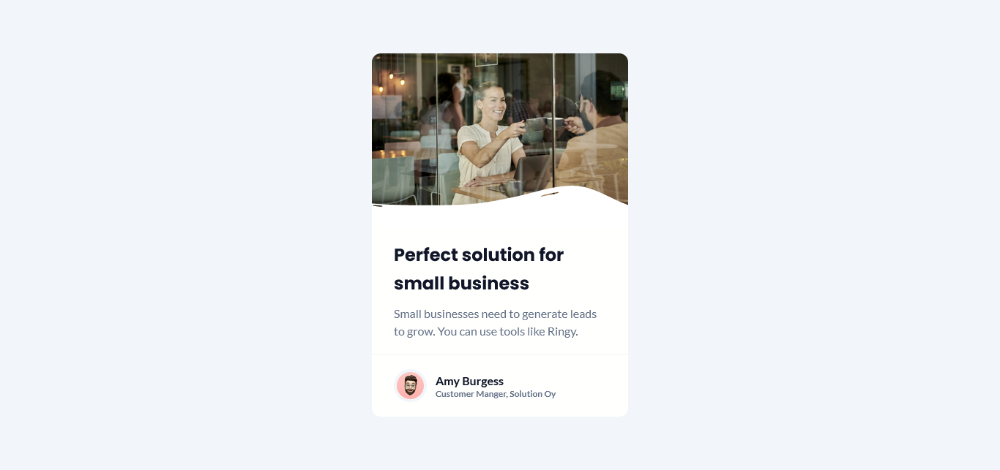

## BUSINESS BLOG CARD

## Le challenge

Création du projet : business blog card en HTML5 et CSS3.

## Démonstration

Lien vers le projet : https://aperbet56.github.io/business_blog_card/

## Projet développé avec

- Utilisation des balises sémantiques HTML5
- CSS3
- Flexbox
- Variables CSS
- Animation CSS (transition)
- Position absolute et position relative
- Page web responsive
- Desktop first
- Utilisation d'un normaliseur : le fichier normalize.css
- Importation des polices "Poppins" et "Lato"
- Commentaires HTML
- Commentaires CSS
